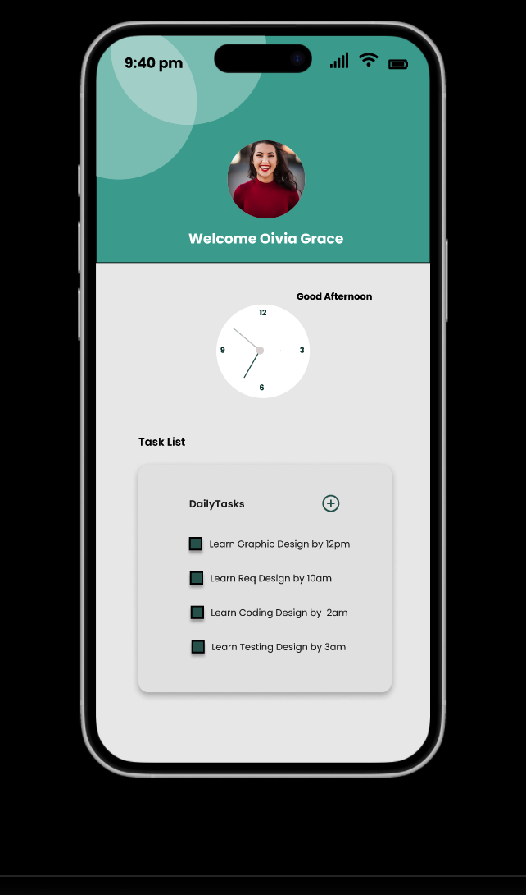

# UI-Designs
You can view the Figma designs here [Design Mockups](https://www.figma.com/proto/NTotVvWzsX7RDD58Ds5OyI/Mobile-App?page-id=0%3A1&node-id=28-280&viewport=247%2C46%2C0.95&t=JJQ57SI1q36ljf3y-1&scaling=scale-down&content-scaling=fixed)
# 🎨 Figma Mock-Up: [Your Project Name]

This repository contains mock-up designs created in **Figma**.  
The designs showcase the full UI/UX flow, reusable components, and interactive prototypes for the application.

---

##  Features Included
- **Figma Plugins**
  - Unsplash for stock images
  - Other productivity plugins
- **Layout Grid** – consistent responsive design grid
- **Adding Designs & Drawing Tools** – shapes, icons, and visual elements
- **Typography & Text Elements** – font hierarchy for headings, labels, and body text
- **Forms**
  - Registration form
  - Login screen
- **Shape Components** – reusable buttons, cards, and input fields
- **Component System** – reusable elements for efficient design
- **Dashboard Design** – structured layout with navigation and widgets
- **Task Lists** – checklist UI for tasks and progress tracking
- **Prototyping** – interactive flows: Registration → Login → Dashboard

---

## Design Previews
Here are some exported screens from the mock-up:

---

## 🔗 Figma File
Explore the full interactive prototype here: [Figma Files](https://www.figma.com/proto/NTotVvWzsX7RDD58Ds5OyI/Mobile-App?page-id=0%3A1&node-id=28-280&viewport=247%2C46%2C0.95&t=JJQ57SI1q36ljf3y-1&scaling=scale-down&content-scaling=fixed)

---

## 📂 Repository Structure

